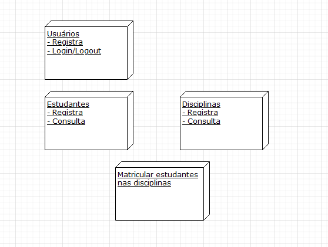
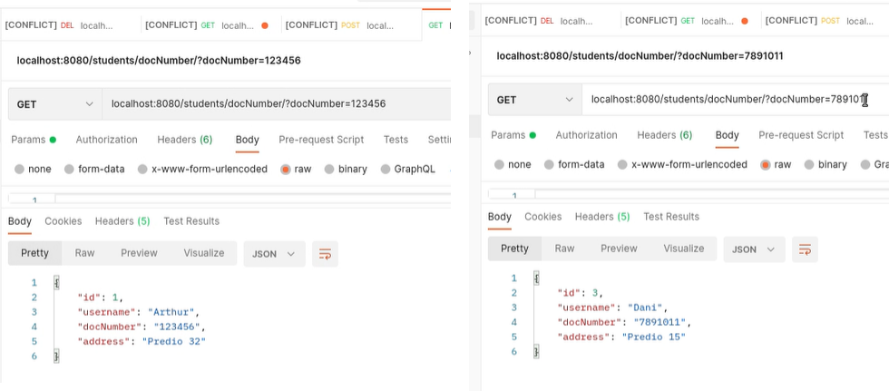
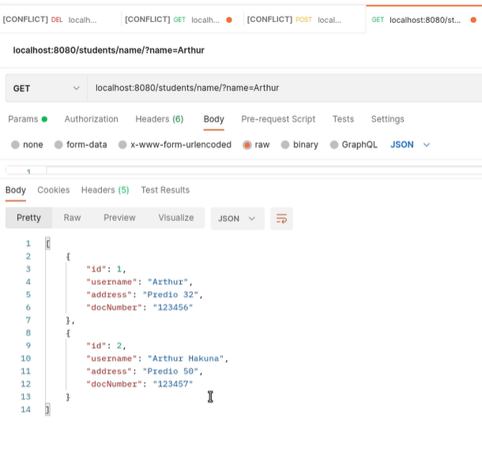

# microservices-spring
Microservices using springboot - Software Engineering 2 

**Objective:** Implement a solution using a microservices-based architecture. This work will aim to implement a solution using microservices


# To excute

### Run docker first time:
	docker-compose up -d
		- roda o docker em modo detach (libera o terminal)
	docker exec -i microservices-spring_db_1 mysql -u root -p123 -f < ./microservices.sql
		- executa o script microservices.sql

## Running docker database:
	- 'docker-compose up'
		- will occupy the host terminal with a log
		- access internal docker bash: 'docker exec -it <container_id> bash' 
## Accessing the database:
	- 'mysql -u root -p'
		- password = 123

### Data will be saved on ./data folder, do not delete it
```
show databases;
use <database_name>;
```

## Shutdown docker:
	- 'docker-compose down'

#### docker compose info
	- https://medium.com/codex/how-to-persist-and-backup-data-of-a-postgresql-docker-container-9fe269ff4334
	- https://www.baeldung.com/ops/docker-compose-expose-vs-ports

# Program information

**Backend Features:**

We sapareted on four microservices, one for students (register, consults), other to subjects, registration and the user (log in and log out). 

- Student port 		8000
- Subject port 		8888
- Registration port 8100
- Student port 		8080



1. Register the student: name, document number, address. To registering the student (avoiding duplication) a registration number is created for the student.


2. Consult a student by registration number;



3. Consult a student for a piece of their name. If more than one "match", return a list;




4. Consult the list of all students;

 

5. register courses, with the data: course code, discipline's name, discipline schedule (by codes: A, B, C, D ...., G), discipline's class (numerical code). Remember that the same discipline (same code and name) can occur more than once (different classes);


6. Enroll student in the discipline: inform the student's registration number, code and class of the discipline.

 

6.1. Get all registrations

 

7. Consult the subjects/classes in which a student is enrolled;

 

8. Consult students enrolled in a discipline/class

 

9. Register system user, with your email, name and password;

 

10. Log in and log out. Note: implements a simple functionality, it is not necessary to use an authentication/authorization framework.

 

  

